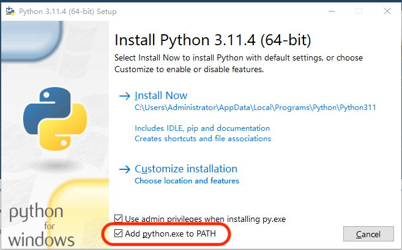
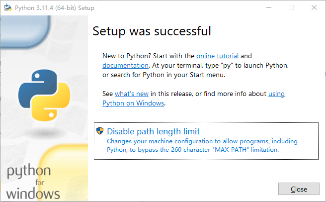
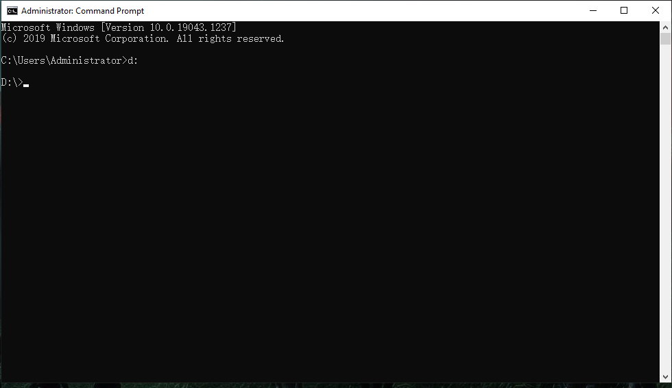

<div align="center">

  
  <h1>MindLake Tutorial: Configure Python</h1>
  
  <p>
    A step-by-step cookbook for Python Configuration !
  </p>
</div>

## :star2: 0. Step by step tutorial
This is part of support chapter for MindLake step-by-step tutorial for [Python](README.md)

## :star2: 1. Configure Python In Your Local Environment

### :notebook_with_decorative_cover: Table of Contents
- [:star2: 0. Step by step tutorial](#star2-0-step-by-step-tutorial)
- [:star2: 1. Configure Python In Your Local Environment](#star2-1-configure-python-in-your-local-environment)
  - [:notebook\_with\_decorative\_cover: Table of Contents](#notebook_with_decorative_cover-table-of-contents)
  - [:art: 1.1 For Mac OS](#art-11-for-mac-os)
    - [:dart: 1.1.1 Choice 1: Install Python with Official Installer](#dart-111-choice-1-install-python-with-official-installer)
      - [:gear: 1.1.1.1 Step1: Download the Official Installer](#gear-1111-step1-download-the-official-installer)
      - [:gear: 1.1.1.2 Step2: Run the Installer](#gear-1112-step2-run-the-installer)
      - [:gear: 1.1.1.3 Step3: Verify the Python Installation](#gear-1113-step3-verify-the-python-installation)
    - [:dart: 1.1.2 Choice 2: Install Python with HomeBrew](#dart-112-choice-2-install-python-with-homebrew)
      - [:gear: 1.1.2.1 Step1: Install HomeBrew (If you don't have Homebrew installed)](#gear-1121-step1-install-homebrew-if-you-dont-have-homebrew-installed)
      - [:gear: 1.1.2.2 Step2: Install Python](#gear-1122-step2-install-python)
      - [:gear: 1.1.2.3 Step3: Verify the Python Installation](#gear-1123-step3-verify-the-python-installation)
  - [:art: 1.2 For Windows](#art-12-for-windows)
    - [:dart: 1.2.1 Step1: Download the Official Installer](#dart-121-step1-download-the-official-installer)
    - [:dart: 1.2.2 Step2: Running the Executable Installer](#dart-122-step2-running-the-executable-installer)
    - [:dart: 1.2.3 Step3: Verify the Python Installation](#dart-123-step3-verify-the-python-installation)

### :art: 1.1 For Mac OS

#### :dart: 1.1.1 Choice 1: Install Python with Official Installer
##### :gear: 1.1.1.1 Step1: Download the Official Installer
Here is an example of Python installation with official installer, you can also choose other package management tools like HomeBrew or Conda.
1. Navigate to python.org, specifically to [Downloads > MacOS](https://www.python.org/downloads/macos/) and download the latest installation file.
2. Click on the latest stable release of Python link under the latest Python releases for macOS. The latest available version of Python as of this writing is 3.11.3

<!--  -->
3. Now you'll be able to see the version-specific information. Scroll down on this page until you see a table with all available installation files.
4. Select and download the file that in the description says macOS under the operating system.

##### :gear: 1.1.1.2 Step2: Run the Installer

To proceed with a default installation of Python, click the "Continue" button. Default option is recommended if you're new to Python and want to install it with standard features. Simply wait for the installation to complete and then click the "Close" button.

##### :gear: 1.1.1.3 Step3: Verify the Python Installation
* Find and open "Terminal" or other shell terminal in LauchPad.

* Enter the following command in terminal:
```shell
python --version
```
An example of the output is:
```
Python 3.11.3
```

#### :dart: 1.1.2 Choice 2: Install Python with HomeBrew
If you need to install Python from the command line on macOS, the Homebrew package manager is a reliable option. Follow the steps below to install Python via Homebrew:
##### :gear: 1.1.2.1 Step1: Install HomeBrew (If you don't have Homebrew installed)
1. Open a browser and go to https://brew.sh.

2. Under the "Install Homebrew" title, copy the command
```shell
/bin/bash -c "$(curl -fsSL https://raw.githubusercontent.com/Homebrew/install/HEAD/install.sh)"
```

3. Then open a terminal window, paste the copied command, and press the 'Enter' or 'Return' button.

4. Enter your macOS credentials if and when asked.
5. If prompted, install Apple's command line developer tools.
6. If prompted, copy, paste and execute the command to add Homebrew to your shell profile file.


##### :gear: 1.1.2.2 Step2: Install Python
1. Enter the following command in terminal to upgrade Homebrew:
```shell
brew update && brew upgrade
```
2. Install Python using this command:
```shell
brew install python3
```


##### :gear: 1.1.2.3 Step3: Verify the Python Installation
Enter the following command in terminal:
```shell
python --version
```
An example of the output is:
```
Python 3.11.3
```


### :art: 1.2 For Windows
#### :dart: 1.2.1 Step1: Download the Official Installer
Here is an example of Python installation with official installer, you can also choose other package management tools like Anaconda.
1. Go to the official Python download page for Windows.
2. Find a stable Python 3 release. This tutorial was tested with Python version 3.11.3.
3. Click the appropriate link for your system to download the executable file: Windows installer (64-bit) or Windows installer (32-bit).

#### :dart: 1.2.2 Step2: Running the Executable Installer
1. After the installer is downloaded, double-click the .exe file, for example python-3.11.3-amd64.exe, to run the Python installer.
2. Select the __Add python.exe to PATH__ checkbox, which enables users to launch Python from the command line.

3. If you’re just getting started with Python and you want to install it with default features as described in the dialog, then click __Install Now__.
4. Simply wait for the installation to complete and then click the __Close__ button.


#### :dart: 1.2.3 Step3: Verify the Python Installation
Press __Win(⊞) + r__ in keyboard and enter `cmd` to open the command prompt.

Enter the following command in the command prompt:
```cmd
python --version
```
An example of the output is:
```
Python 3.11.3
```
