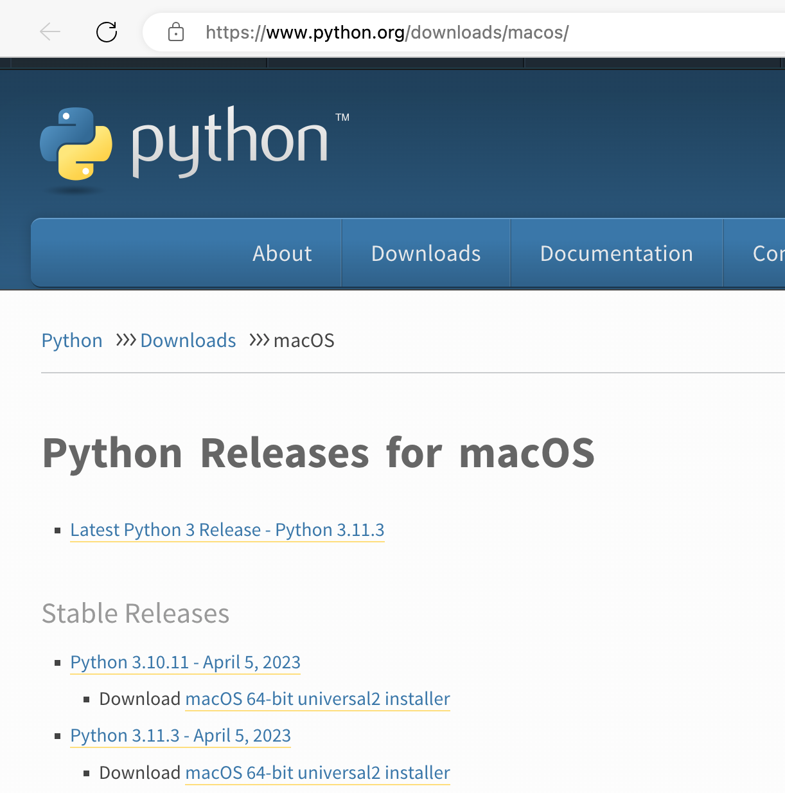
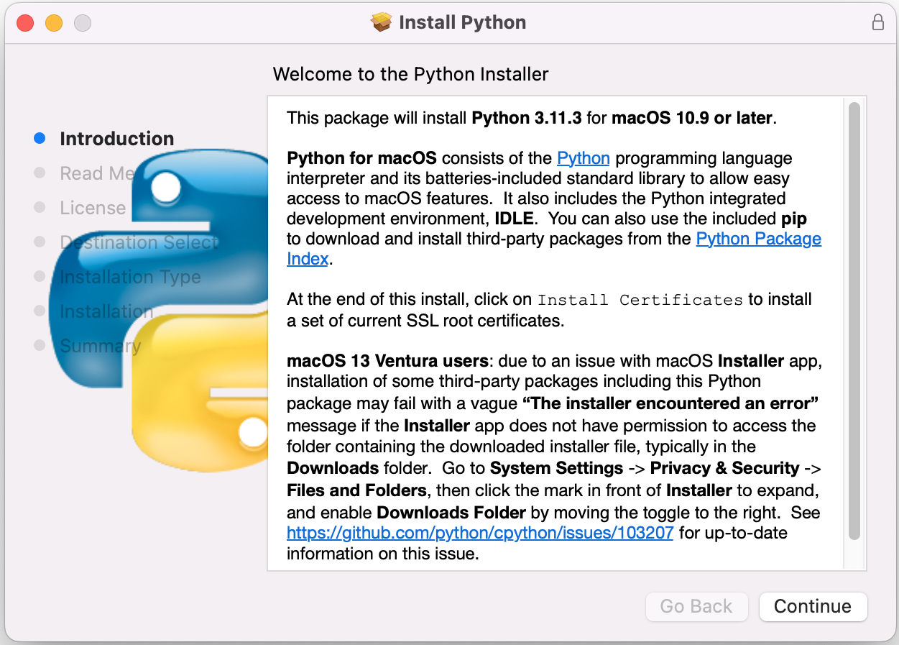
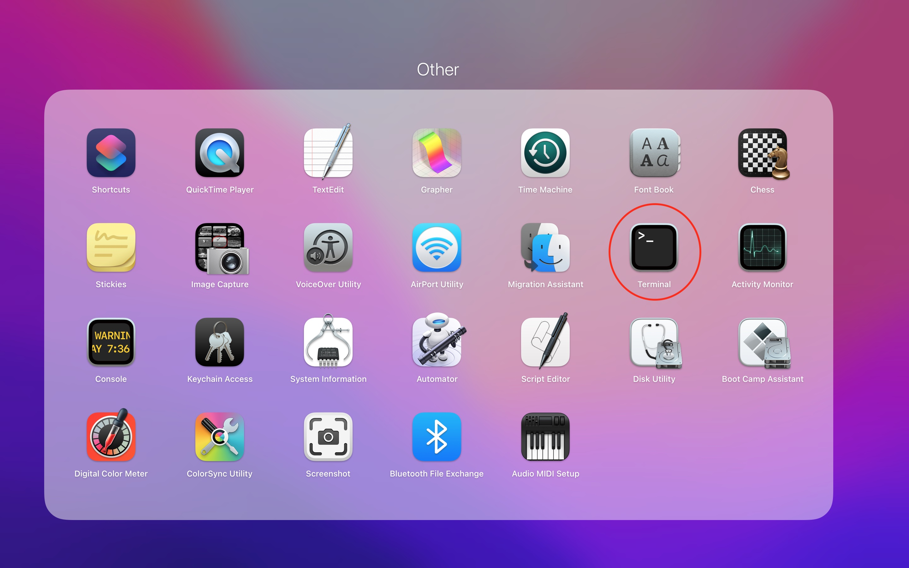
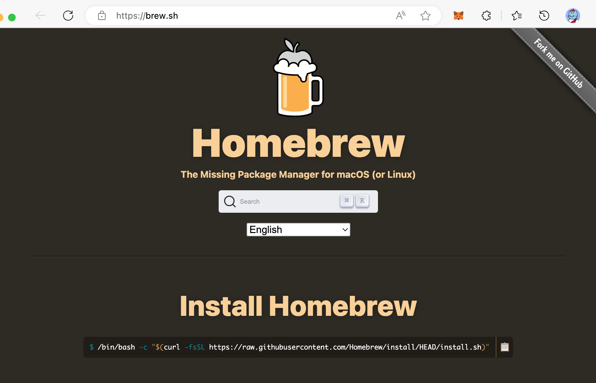
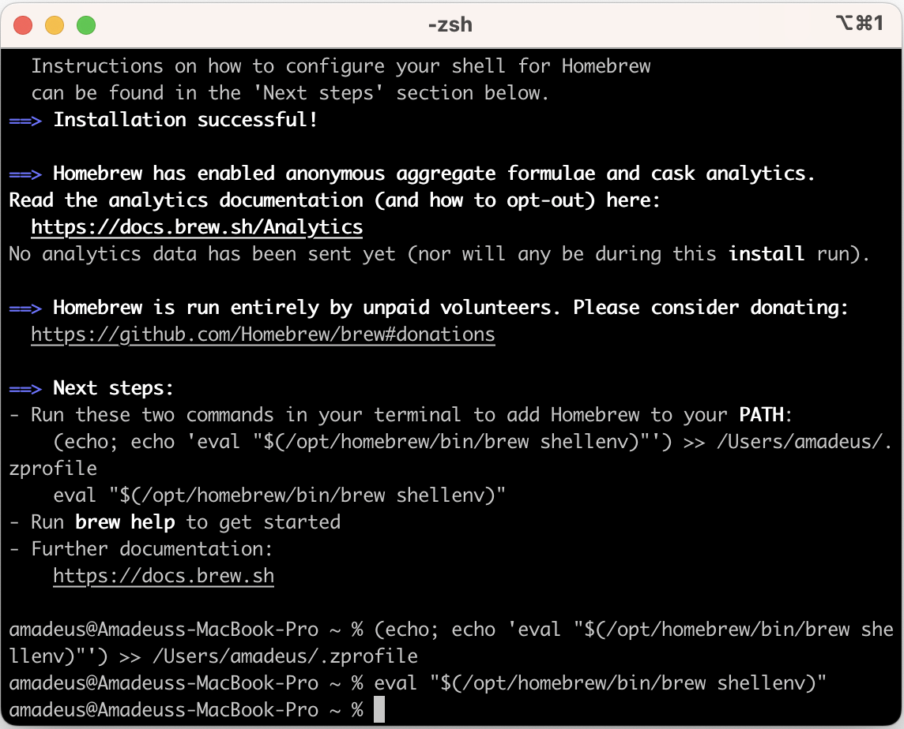
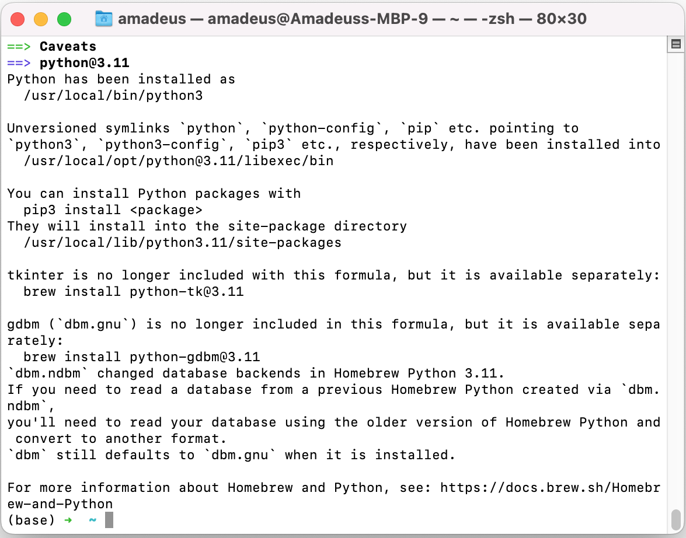
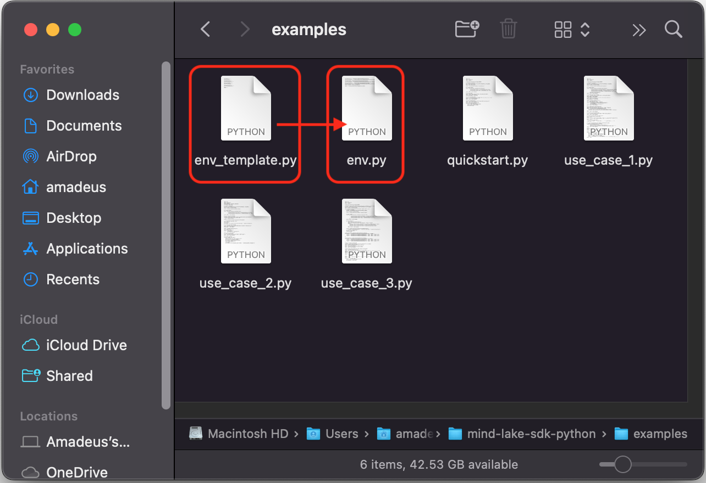
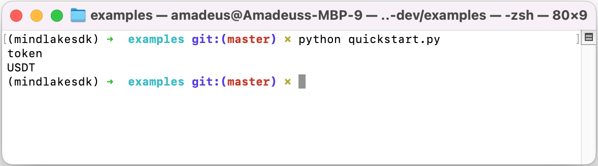
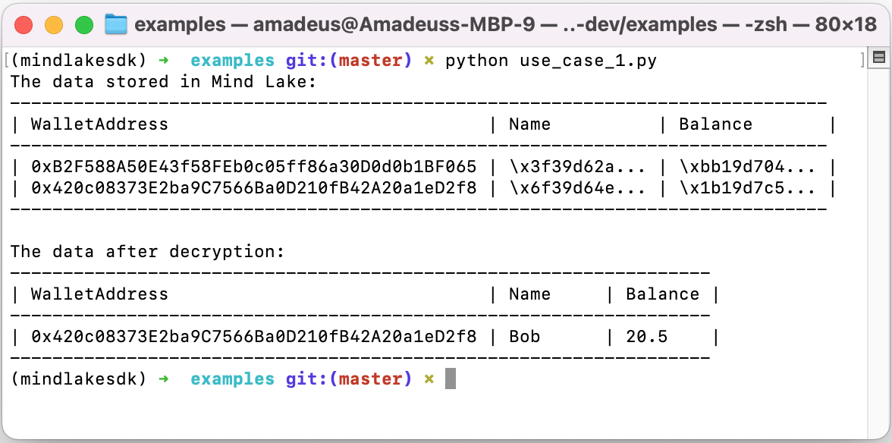
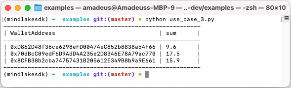

<div align="center">

  
  <h1>MindLake Python SDK Tutorial</h1>
  
  <p>
    A step-by-step cookbook for beginner to access Mind Lake !
  </p>
</div>

<!-- toc generator: 1. install "markdown all in one" in vs code, 2. cmd: create table of contents -->
<!-- Table of Contents -->
## :notebook_with_decorative_cover: Table of Contents
- [:notebook\_with\_decorative\_cover: Table of Contents](#notebook_with_decorative_cover-table-of-contents)
- [:star2: 0. Other Programming Languages](#star2-0-other-programming-languages)
- [:star2: 1. Install Python](#star2-1-install-python)
  - [:art: 1.1 For Mac OS](#art-11-for-mac-os)
    - [:dart: 1.1.1 Choice 1: Install Python with Official Installer](#dart-111-choice-1-install-python-with-official-installer)
      - [:gear: 1.1.1.1 Step1: Download the Official Installer](#gear-1111-step1-download-the-official-installer)
      - [:gear: 1.1.1.2 Step2: Run the Installer](#gear-1112-step2-run-the-installer)
      - [:gear: 1.1.1.3 Step3: Verify the Python Installation](#gear-1113-step3-verify-the-python-installation)
    - [:dart: 1.1.2 Choice 2: Install Python with HomeBrew](#dart-112-choice-2-install-python-with-homebrew)
      - [:gear: 1.1.2.1 Step1: Install HomeBrew (If you don't have Homebrew installed)](#gear-1121-step1-install-homebrew-if-you-dont-have-homebrew-installed)
      - [:gear: 1.1.2.2 Step2: Install Python](#gear-1122-step2-install-python)
      - [:gear: 1.1.2.3 Step3: Verify the Python Installation](#gear-1123-step3-verify-the-python-installation)
  - [:art: 1.2 For Windows](#art-12-for-windows)
    - [:dart: 1.2.1 Step1: Download the Official Installer](#dart-121-step1-download-the-official-installer)
    - [:dart: 1.2.2 Step2: Running the Executable Installer](#dart-122-step2-running-the-executable-installer)
    - [:dart: 1.2.3 Step3: Verify the Python Installation](#dart-123-step3-verify-the-python-installation)
- [:star2: 2. Install MindLakeSDK](#star2-2-install-mindlakesdk)
- [:star2: 3. Get Examples](#star2-3-get-examples)
- [:star2: 4. Prepare env.py](#star2-4-prepare-envpy)
  - [:art: 4.1. Prepare Wallet](#art-41-prepare-wallet)
    - [:dart: 4.1.1 Install Wallet](#dart-411-install-wallet)
    - [:dart: 4.1.2 Wallet Sign In: https://scan.mindnetwork.xyz](#dart-412-wallet-sign-in-httpsscanmindnetworkxyz)
    - [:dart: 4.1.3 Register wallets if not in whitelist during testing period](#dart-413-register-wallets-if-not-in-whitelist-during-testing-period)
    - [:dart: 4.1.4 Copy the wallet address from MetaMask to env.py](#dart-414-copy-the-wallet-address-from-metamask-to-envpy)
    - [:dart: 4.1.4 Export private key from MetaMask to env.py](#dart-414-export-private-key-from-metamask-to-envpy)
  - [:art: 4.2. Prepare appKey](#art-42-prepare-appkey)
      - [:dart: 4.2.1 create Dapp](#dart-421-create-dapp)
- [:star2: 5. Execute the examples](#star2-5-execute-the-examples)
  - [:art: 5.1 QuickStart](#art-51-quickstart)
  - [:art: 5.2 Use Case 1: Single User with Structured Data](#art-52-use-case-1-single-user-with-structured-data)
  - [:art: 5.3 Use Case 2: Single User with Unstructured Data](#art-53-use-case-2-single-user-with-unstructured-data)
  - [:art: 5.4 Use Case 3: Multi Users with Permission Sharing](#art-54-use-case-3-multi-users-with-permission-sharing)


## :star2: 0. Other Programming Languages
- [TypeScript](https://github.com/mind-network/mind-lake-sdk-typescript/tutorial)

## :star2: 1. Install Python

### :art: 1.1 For Mac OS

#### :dart: 1.1.1 Choice 1: Install Python with Official Installer
##### :gear: 1.1.1.1 Step1: Download the Official Installer
Here is an example of Python installation with official installer, you can also choose other package management tools like HomeBrew or Conda.
1. Navigate to python.org, specifically to [Downloads > MacOS](https://www.python.org/downloads/macos/) and download the latest installation file.
2. Click on the latest stable release of Python link under the latest Python releases for macOS. The latest available version of Python as of this writing is 3.11.3

<!--  -->
3. Now you'll be able to see the version-specific information. Scroll down on this page until you see a table with all available installation files.
4. Select and download the file that in the description says macOS under the operating system.

##### :gear: 1.1.1.2 Step2: Run the Installer

To proceed with a default installation of Python, click the "Continue" button. Default option is recommended if you're new to Python and want to install it with standard features. Simply wait for the installation to complete and then click the "Close" button.

##### :gear: 1.1.1.3 Step3: Verify the Python Installation
* Find and open "Terminal" or other shell terminal in LauchPad.

* Enter the following command in terminal:
```shell
python --version
```
An example of the output is:
```
Python 3.11.3
```

#### :dart: 1.1.2 Choice 2: Install Python with HomeBrew
If you need to install Python from the command line on macOS, the Homebrew package manager is a reliable option. Follow the steps below to install Python via Homebrew:
##### :gear: 1.1.2.1 Step1: Install HomeBrew (If you don't have Homebrew installed)
1. Open a browser and go to https://brew.sh.

2. Under the "Install Homebrew" title, copy the command
```shell
/bin/bash -c "$(curl -fsSL https://raw.githubusercontent.com/Homebrew/install/HEAD/install.sh)"
```

3. Then open a terminal window, paste the copied command, and press the 'Enter' or 'Return' button.

4. Enter your macOS credentials if and when asked.
5. If prompted, install Apple's command line developer tools.
6. If prompted, copy, paste and execute the command to add Homebrew to your shell profile file.


##### :gear: 1.1.2.2 Step2: Install Python
1. Enter the following command in terminal to upgrade Homebrew:
```shell
brew update && brew upgrade
```
2. Install Python using this command:
```shell
brew install python3
```




##### :gear: 1.1.2.3 Step3: Verify the Python Installation
Enter the following command in terminal:
```shell
python --version
```
An example of the output is:
```
Python 3.11.3
```


### :art: 1.2 For Windows
#### :dart: 1.2.1 Step1: Download the Official Installer
Here is an example of Python installation with official installer, you can also choose other package management tools like Anaconda.
1. Go to the official Python download page for Windows.
2. Find a stable Python 3 release. This tutorial was tested with Python version 3.11.3.
3. Click the appropriate link for your system to download the executable file: Windows installer (64-bit) or Windows installer (32-bit).

#### :dart: 1.2.2 Step2: Running the Executable Installer
1. After the installer is downloaded, double-click the .exe file, for example python-3.10.10-amd64.exe, to run the Python installer.
2. Select the Install launcher for all users checkbox, which enables all users of the computer to access the Python launcher application.
3. Select the Add python.exe to PATH checkbox, which enables users to launch Python from the command line.
4. If you’re just getting started with Python and you want to install it with default features as described in the dialog, then click Install Now.

#### :dart: 1.2.3 Step3: Verify the Python Installation
Go to Start and enter cmd in the search bar. Click Command Prompt.
Enter the following command in the command prompt:
```cmd
python --version
```
An example of the output is:
```
Python 3.11.3
```


## :star2: 2. Install MindLakeSDK
Enter the following command in the terminal window:
```shell
pip install mindlakesdk
```
The required package will be automatically installed as a dependency, and get the following output in the end:
```
Installing collected packages: mindlakesdk
Successfully installed mindlakesdk-1.0.1
```
You can validate the installation 
```
$ pip show mindlakesdk
Name: mindlakesdk
Version: 1.0.1
Summary: A Python SDK to connect to Mind Lake
Home-page:
Author:
Author-email: Mind Labs <biz@mindnetwork.xyz>
License:
Location: /Users/xxx/.pyenv/versions/3.10.11/lib/python3.10/site-packages
Requires: eth-account, pynacl, web3
Required-by:
```
You can also validate in python idel
```
$ python3
Python 3.10.11 (main, May  1 2023, 01:38:51) [Clang 16.0.2 ] on darwin
Type "help", "copyright", "credits" or "license" for more information.
>>> import mindlakesdk
>>>
```


## :star2: 3. Get Examples
1. Enter the following command in the terminal window to fetch the example code from github:
```shell
git clone https://github.com/mind-network/mind-lake-sdk-python.git
```
2. Enter the path of example code:
```shell
cd mind-lake-sdk-python/examples
```


## :star2: 4. Prepare env.py
env.py contains the settings of parameters used in examples and use cases, you can copy `env_template.py` to the name `env.py` and modify it as per your requirement. If you want to run the examples of QuickStart, Use Case 1 and Use Case 2, you only need to fill out `walletAddressAlice`, `walletPrivateKeyAlice` and `appKey`. If you want to run Use Case 3, you need to fill out the walltes info for all of `Alice`, `Bob` and `Charlie`.



### :art: 4.1. Prepare Wallet

#### :dart: 4.1.1 Install Wallet
1. Install [MetaMask](https://metamask.io/download/) plugins in Chrome Browser
2. [Sign up a MetaMask Wallet](https://myterablock.medium.com/how-to-create-or-import-a-metamask-wallet-a551fc2f5a6b)
3. Change the network to Goerli TestNet
4. Goerli Faucet for later gas fee if does not have: [Alchemy Goerli Faucet](https://goerlifaucet.com/), [Quicknode Goerli Faucet](https://faucet.quicknode.com/ethereum/goerli), [Moralis Goerli Faucet](https://moralis.io/faucets/)

  
  
#### :dart: 4.1.2 Wallet Sign In: https://scan.mindnetwork.xyz
1. Open a browser and visit [mind-scan](https://scan.mindnetwork.xyz/scan)
2. Click "Sign in" buttom

  
  
2.1 During the 'Connect' procedure, the wallet will prompt the user 2-3 times as follows:
   Sign a nonce for login authentication.
  
  
  
2.2 If the user's account keys are already on the chain: Decrypt the user's account keys using the wallet's private key.
  
  

2.3 If the user's account keys do not exist yet: Obtain the public key of the wallet, which is used to encrypt the randomly generated account keys.
  
  

2.4 Sign the transaction to upload the encrypted key ciphers to the smart contract on the chain.
  
  

#### :dart: 4.1.3 Register wallets if not in whitelist during testing period
1. If not in whitelist, there will be a pop-up prompt
  
  

2. Click [Apply for test link ](https://bit.ly/mindalphatest)
3. After successful application, Please be patient and wait for the review.

#### :dart: 4.1.4 Copy the wallet address from MetaMask to env.py
Click the copy icon beside the wallet address in UI of MetaMask, and paste into env.py
#### :dart: 4.1.4 Export private key from MetaMask to env.py
These are the steps outlined in the [MetaMask support documentation](https://support.metamask.io/hc/en-us/articles/360015289632-How-to-export-an-account-s-private-key).
1. Click on the identicon in the top right.
2. Select the account you'd like to export.
3. On the account page, click on the menu (three dots) in the upper right corner, and then on the "Account Details" button.
4. Click “Export Private Key”.
5. To access your private key, you'll now need to enter your wallet password. Once you've done so, click “Confirm” to proceed.
6. Your private key will now be revealed. Click to copy it, and paste into env.py.
7. Click “Done” to close the screen.


### :art: 4.2. Prepare appKey

##### :dart: 4.2.1 create Dapp
1. Click `myDapp` in left side manu


2. Click "Create Dapp" 


3. Input your Dapp name and then click "Create"


4. copy appKey value into env.py to update "appKey"


## :star2: 5. Execute the examples
You can execute the following commands to run the quickstart and use cases.
### :art: 5.1 QuickStart
```shell
python quickstart.py
```

### :art: 5.2 Use Case 1: Single User with Structured Data
```shell
python use_cases_1.py
```

### :art: 5.3 Use Case 2: Single User with Unstructured Data
```shell
python use_cases_2.py
```
You can also check the result by opening these two picture files.

<!--  -->
### :art: 5.4 Use Case 3: Multi Users with Permission Sharing
```shell
python use_cases_3.py
```
